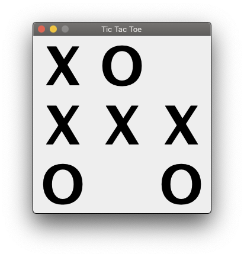

# Using EMF adapters

[eclipse modelling framework (emf)]: https://www.eclipse.org/modeling/emf/
[adapter interface]: https://download.eclipse.org/modeling/emf/emf/javadoc/2.11/org/eclipse/emf/common/notify/Adapter.html

The [Eclipse Modelling Framework (EMF)] provides an [Adapter Interface] that can be implemented to observe model instances or extend their functionality. EMF provides mechanisms to generate adapters, for example for editing. Here, however, we will focus on writing adapters ourselves and associating them with model instances.

First, we will look at an application that can be used to play [Tic-Tac-Toe]. The game state of this application is modeled using EMF and additional functionality is implemented in static methods. Then we will refactor the application to implement the same functionality using EMF adapters. We will observe opportunities to extract duplicated parts of the adapter implementations into a common base class. As the implementation uses [lambda expressions] and [type parameters], we will discuss both concepts along the way.

If you want to practice using EMF adapters, there are programming tasks related to

- refactoring the adapters to use the base class for type safe adapters of EMF objects
- as well as extending their functionality further by adding a check of the winning condition
- and the ability to reset games.

[tic-tac-toe]: https://en.wikipedia.org/wiki/Tic-tac-toe
[lambda expressions]: https://docs.oracle.com/javase/tutorial/java/javaOO/lambdaexpressions.html
[type parameters]: https://docs.oracle.com/javase/tutorial/java/generics/index.html

The source code discussed in this tutorial is available online - including solutions to the programming tasks.
